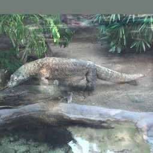
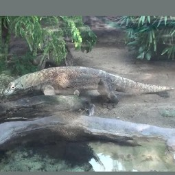
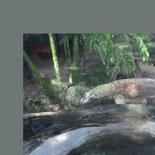
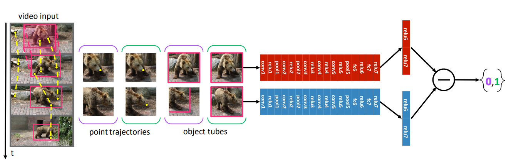
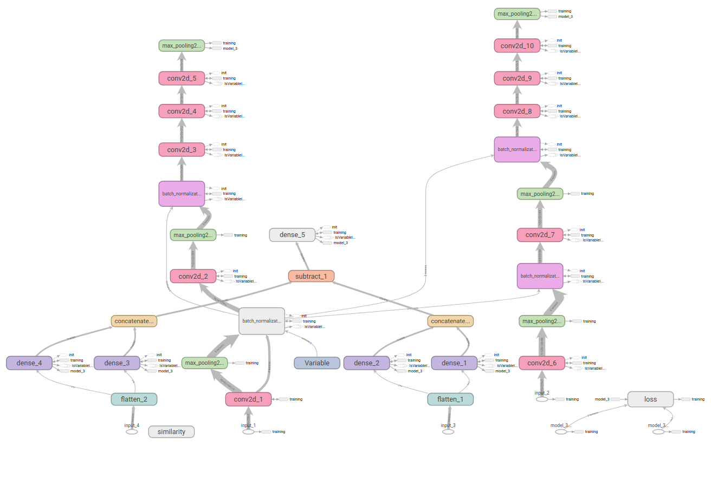

# Association-Net
This is an unofficial implementation of the Paper  "Learning Feature Hierarchies from Long-Range Temporal Associations in Videos"  By Panna Felsen Katerina Fragkiadaki Jitendra Malik Alexei Efros


## Introduction

The following is an Unofficial implementation of [Learning Feature Hierarchies from Long-Range Temporal Associations in Videos](https://arxiv.org/pdf/1801.00508.pdf) by Panna Felsen, Katerina Fragkiadaki, Jitendra Malik and Alexei Efros. 

The folllowing topics are covered by my project:
- [x] **Data-Preprocessing**. Build pairs of object tubes which follow and dont follow the object
- [x] **Build a Network for Attention Model**. Built using Keras follows the same architecture as mentioned in the paper.
- [x] **Pretraining Yolo**. Use the weights of the Attention Model for object localization in Yolo Architecture 
- [x] **Readability**. The code is very clear,well documented and consistent.


<pre>                    Same&nbsp;&nbsp                                                Different</pre>

<pre>                          
                          </pre>


## Model

Network in the Paper



Tensorboard Graph in Network



## Data Processing
We would be training our AssociationNet using Object Tubes which contains a pair of images in which the object is being tracked and a pair in which it is not tracked. As the data is not labeled it can be considered as an Unsupervised way of learning.

**First Get Dataset from the Image Net website from the following link**
Augment the folder ILSVRC2015 with the new data


*Run the following script to form the pairs of Object Tubes*

```bash
python scripts/build_VID2015_imdb.py
```
*Next the script creates a structured pickled file of the data*
```bash
python scripts/build_VID2015_imdb.py
```

## Train Association Net

The credit for the base script goes to ''. Although I have made few changes in it to fit our data requirements.

*Train the Siamese Model by the following script*
```bash 
python train.py
```
*The weights will be saved in weights.h5*

## Pretrain Yolo

*You can use these weights in training the Yolo Architecture by running the following code*

```bash
cd keras-yolo2/
python train.py  -c config.json
```

*You can evaluate the yolo architecture by the following script*
```

python predict.py -c config.json -w /path/to/best_weights.h5 -i /path/to/image/or/video
```

I have used the existing keras implemetation of Yolo from the following link
